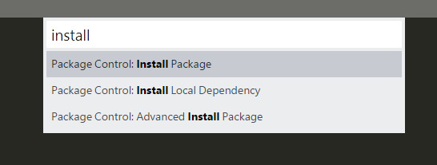
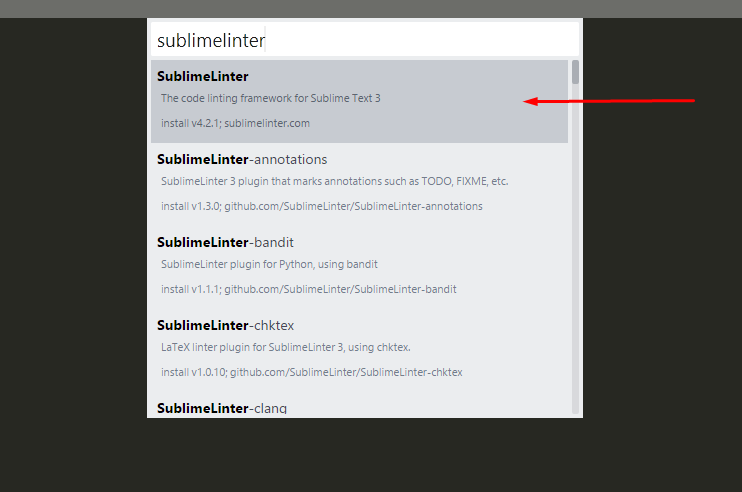
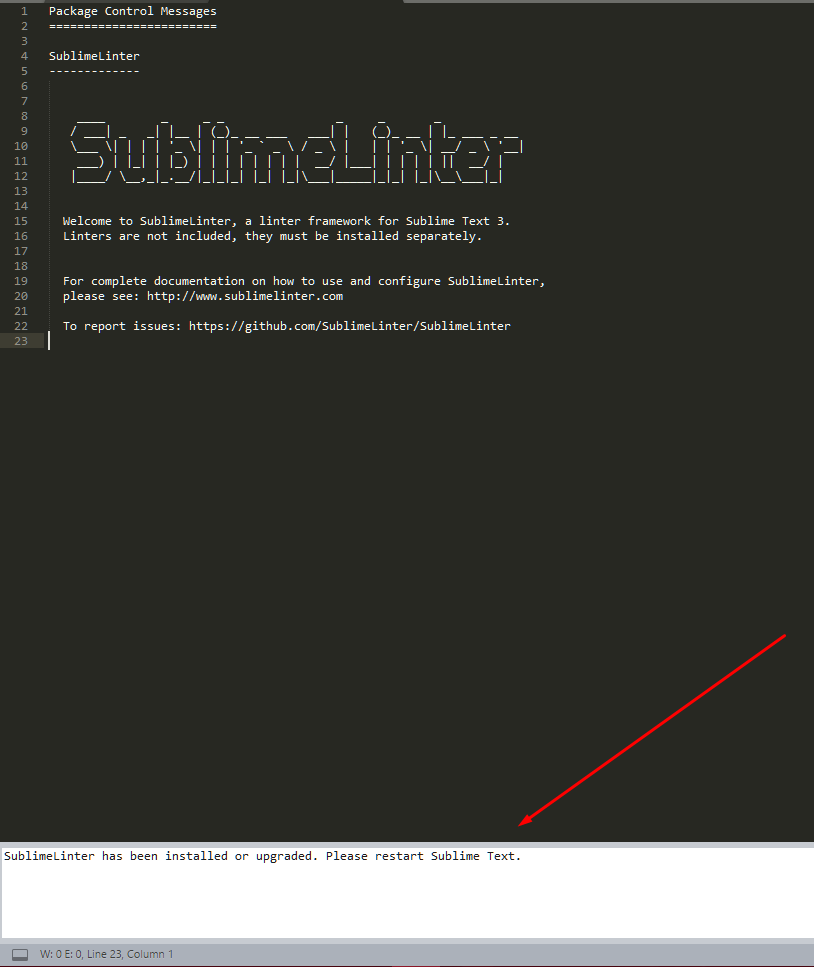
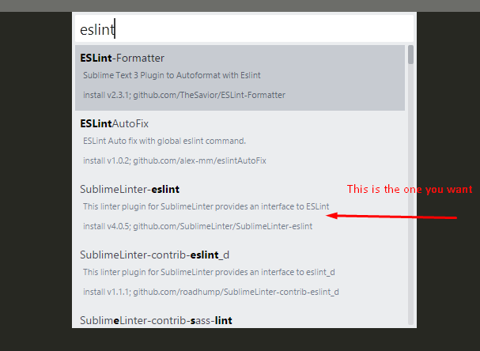
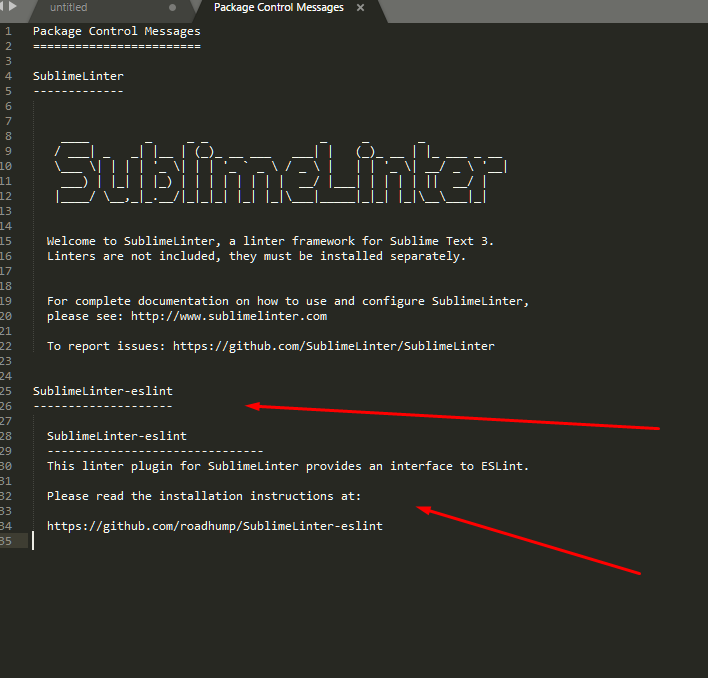
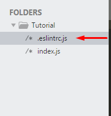

# Sublime

For those of you whom are using the sublime text editor here is how you're going to setup eslint

## Install Eslint Package

First things first we need to install the eslint package from npm. Using our handy dandy npm install command.

Here's what you're going to enter:

`npm i -g eslint`

**Side Note: Anyone using unix (mac or linux users) you may have to do `sudo npm i -g eslint` to install globally**

Few things to note: the `-g` here is VERY important. This tells npm that you want to globally install the eslint package to your machine.

But the good thing is now you have eslint installed, now we just need to setup sublime!

## Setting Up Sublime Text

So we need to use package control to install sublime linter. Remeber to open the "terminal" or input for this you have to use the `ctrl + shift + p` on windows/linux and `⌘ + ⇧ + P` on mac

Once that little input box opens start type `install`



Click on `Package Control: Install Package`

**What if I don't see that?** : Well that means you don't have package control installed on your sublime text. My guide on recommended sublime packages has a section on how to install package control, check it out here: https://gist.github.com/dhershman1/56e34b4c2f572dcda5acffad34eef1c1#how-to-install-sublime-text-packages


When you click that button a new **clear** input box should open, inside this one start typing `sublimelinter` you should see it in the dropdown below.



This will install the required linter package for sublime.

**During the Install you should see this in the bottom left corner of your sublime text window**


**Once the package has finished installing and it was successful you should see the following in your sublime text window**



Take note of the message below, and follow it's instructions, go ahead and restart sublime.

Now we need to install the eslint plugin for sublimelinter.

Once again open package control, type install and click on `Package Control: Install Package`

This time in the clear input box type out `eslint` You will again see the drop down appear, look for a package called `Sublimelinter-eslint`



Once this package successfully installs you do **NOT** need to restart sublime text, but you should see a new addition to your package control messages



Great, now both `Sublimelinter` & `Sublimelinter-eslint` have been installed successfully.

## Using Eslint

So we're not quite done yet! Now in order to use these packages and eslint, we need create whats known as a `.eslintrc` file. This file is fine to push up to github with your projects and all that good stuff. This files main purpose is to simply hold your eslint rules you'd like to use.

So inside your project folder (root level) create a new file called `.eslintrc.js` note it has to be `.eslintrc.js` the dot there is not an accident.



Inside this file we can easily setup a list of rules or use one of the already-built lists from eslint! Let's go over how:

**The eslintrc file is attached to this repo if you want to check it out**

So remember that it is a .js file still so we need to `export` our object of rules using `module.exports`.

For our example we are going to use an already existing list known as the "recommended" list and then to show off how I will also attach a custom rule I want to edit.

You can read all about using this in more detail on the eslint site which can be found here: https://eslint.org/docs/user-guide/configuring

In order to use a list that already exists, we want to use a propert called `extend` and then the value is going to be `eslint:recommended`

We also what to set the `env` (environment) property to let eslint know we are working in a browser environment. This can also have other properties like `node` for instance as well as browser. Check out the docs on `env` to learn more.

So far our file should look like this:

```js
module.exports = {
  extends: "eslint:recommended",
  env: {
    browser: true
  }
};
```

Let's add a custom rule just for funsies. so the `eslint:recommended` rule set will treat console statements as an error if they exist. Which when developing getting yelled at about console statements can be annoying. So let's change that rule to give us a warning instead of an error.

Your config should look something like this:

```js
module.exports = {
  extends: "eslint:recommended",
  env: {
    browser: true
  },
  rules: {
    "no-console": "warn"
  }
};
```

Notice I added a `rules` property, which will contain all of your custom rules and tweaks you want to use. With this rule in place `console.log` will be treated as a warning instead of an error.

And now we are done, you have successfully setup and used eslint!

**REMEMBER EACH PROJECT YOU CREATE WILL NEED THAT ESLINT FILE `.eslintrc.js`**

>Pro Tip: If you Create a main folder and then put all of your activity/project folders within that same root folder, you only need to keep a `.eslintrc.js` at the root level.

Example:
```
project
| .eslintrc.js
| - Activity1
| -- thing.js
| - Activity2
| -- thing.js
```
