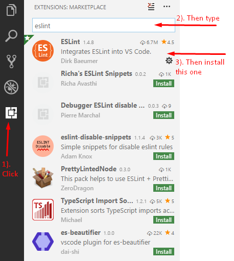
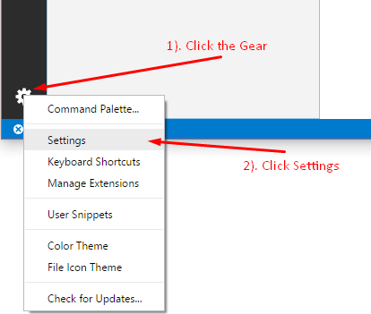

# VSCode

For anyone who is using the VSCode IDE this README will cover how to setup and use eslint with your projects/works

## Install Eslint Package

First things first we need to install the eslint package from npm. Using our handy dandy npm install command.

Here's what you're going to enter:

`npm i -g eslint`

**Side Note: Anyone using unix (mac or linux users) you may have to do `sudo npm i -g eslint` to install globally**

Few things to note: the `-g` here is VERY important. This tells npm that you want to globally install the eslint package to your machine.

But the good thing is now you have eslint installed, now we just need to setup vscode!

## Setting up VSCode

So first we need to install the ESLint extension from our vscode list.



Once that finishes installing click the reload button that should show up on that item once it finishes installing.

Now that this is done we have eslint on our vscode and on our machine! So we are almost there

We want to add a quick setting to our vscode settings so that even if we are writing out javascript inside of `.html` files it will still get linted!



A new tab should open with 2 panels. The panel on the left is the `default` vscode settings the panel on the right is the tweaks/changes you want to apply to vscode settings.

So we want to change the files vscode validates to make sure it gets html files too. (By default it only does JS files)

So go ahead and place this between the two curly brackets `{}` on the right side this is a JSON format so if you already have some settings in here make sure to put a comma in to seperate the two.

```json
"eslint.validate": ["javascript", "javascriptreact", "html"]
```

Go ahead and save and close the settings tab and you are all set!

**Be sure that whenever you create a folder for a new project or activity that you make sure to put a `.eslintrc.js` file with it so the linter knows what to use.**

>Pro Tip: If you Create a main folder and then put all of your activity/project folders within that same root folder, you only need to keep a `.eslintrc.js` at the root level.

Example:
```
project
| .eslintrc.js
| - Activity1
| -- thing.js
| - Activity2
| -- thing.js
```