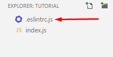

# VSCode

For anyone who is using the VSCode IDE this README will cover how to setup and use eslint with your projects/works

## Install Eslint Package

First things first we need to install the eslint package from npm. Using our handy dandy npm install command.

Here's what you're going to enter:

`npm i -g eslint`

**Side Note: Anyone using unix (mac or linux users) you may have to do `sudo npm i -g eslint` to install globally**

Few things to note: the `-g` here is VERY important. This tells npm that you want to globally install the eslint package to your machine.

But the good thing is now you have eslint installed, now we just need to setup vscode!

## Setting up VSCode

So first we need to install the ESLint extension from our vscode list.


Once that finishes installing click the reload button that should show up on that item once it finishes installing.

Now that this is done we have eslint on our vscode and on our machine! So we are almost there

We want to add a quick setting to our vscode settings so that even if we are writing out javascript inside of `.html` files it will still get linted!


A new tab should open with 2 panels. The panel on the left is the `default` vscode settings the panel on the right is the tweaks/changes you want to apply to vscode settings.

So we want to change the files vscode validates to make sure it gets html files too. (By default it only does JS files)

So go ahead and place this between the two curly brackets `{}` on the right side this is a JSON format so if you already have some settings in here make sure to put a comma in to seperate the two.

```json
"eslint.validate": ["javascript", "javascriptreact", "html"]
```

Go ahead and save and close the settings tab and you are all set!

## Using ESlint

So make sure in your project folder you create whats called a `.eslintrc` file. In our case we will have `.eslintrc.js` as our full file.



Inside this new file we can specify settings and rules, or even extend an already created list to use!

So remember that it is a .js file still so we need to `export` our object of rules using `module.exports`.

For our example we are going to use an already existing list known as the "recommended" list and then to show off how I will also attach a custom rule I want to edit.

You can read all about using this in more detail on the eslint site which can be found here: https://eslint.org/docs/user-guide/configuring

In order to use a list that already exists, we want to use a propert called `extend` and then the value is going to be `eslint:recommended`

We also what to set the `env` (environment) property to let eslint know we are working in a browser environment. This can also have other properties like `node` for instance as well as browser. Check out the docs on `env` to learn more.

So far our file should look like this:

```js
module.exports = {
  extends: "eslint:recommended",
  env: {
    browser: true
  }
};
```

Let's add a custom rule just for funsies. so the `eslint:recommended` rule set will treat console statements as an error if they exist. Which when developing getting yelled at about console statements can be annoying. So let's change that rule to give us a warning instead of an error.

Your config should look something like this:

```js
module.exports = {
  extends: "eslint:recommended",
  env: {
    browser: true
  },
  rules: {
    "no-console": "warn"
  }
};
```

Notice I added a `rules` property, which will contain all of your custom rules and tweaks you want to use. With this rule in place `console.log` will be treated as a warning instead of an error.

And now we are done, you have successfully setup and are ready to use eslint!

**Be sure that whenever you create a folder for a new project or activity that you make sure to put a `.eslintrc.js` file with it so the linter knows what to use.**

>Pro Tip: If you Create a main folder and then put all of your activity/project folders within that same root folder, you only need to keep a `.eslintrc.js` at the root level.

Example:
```
project
| .eslintrc.js
| - Activity1
| -- thing.js
| - Activity2
| -- thing.js
```